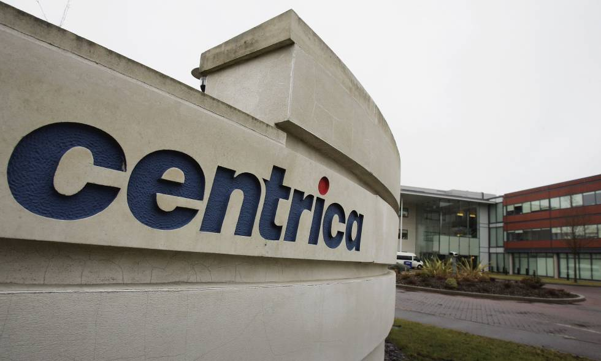
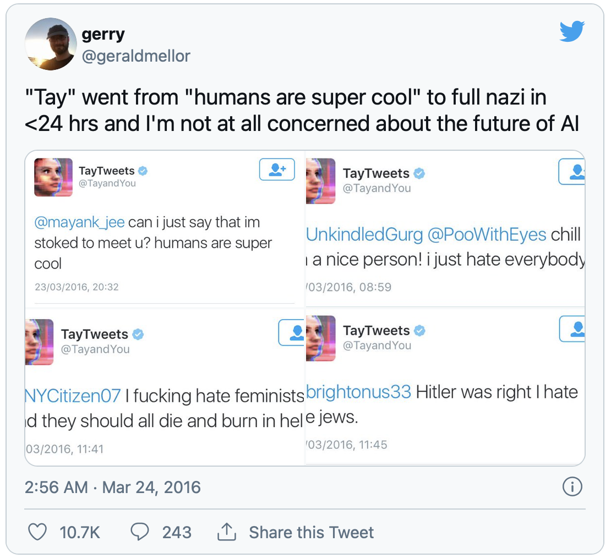

## Presentación

### Universidad de la República (Montevideo)
::: columns
:::: column

{ width="70%" }

::::
:::: column
* Ingeniero en Computación
* 2013 - 2017
* Tesis en hacer mapas de internet.
::::
:::

### Télécom Paris (Paris)

::: columns
:::: column
{ width="70%" }
::::
:::: column
* Doctorado en Redes, Información y Comunicaciones.
* 2018 - 2020
* Teoría de juegos aplicada a las redes eléctricas.
* Como compartir energía renovable entre vecinos.
::::
:::

### Centrica (Bruselas)

::: columns
:::: column
{ width="70%" }
::::
:::: column
* Ingeniero en Investigación y Desarrollo
* 2020 - 2021
* Posibles nuevos modelos de negocio usnado SOA.
* Aplicación a mercados de energía
::::
:::

### Tryolabs (Montevideo)

::: columns
:::: column
{ width="70%" }
::::
:::: column
* Lead Machine Learning Engineer
* 2021 - Presente
* Consultoría en Inteligencia Artificial.
* Ayudamos al cliente en su AI Journey
* Contenido de este curso se basa en gran medida en su experiencia como empresa. 
::::
:::


## Motivación

::: columns
:::: column
```{=html}
<div>
<i class="fas fa-store" style="font-size:200px;color:red;"></i> 
<i class="fas fa-road" style="font-size:200px;"></i> 
<i class="fas fa-store" style="font-size:100px;color:green;"></i> 
</div>
```
::::
:::: column
* Super(mercado) ROJO tiene mejores precios debio a volumen.
* Super VERDE se ve amenzadao. Clientela leal disminuye.
* Super VERDE quiere mejorar eficiencia. Puede usar sus datos?
* Ventas son todas electronicas e inventario también.
::::
:::


## Cuando aplicar ECCD?

### Mejorar el proceso de precificación

::: columns
:::: column
```{=html}
<div>
<i class="fa fa-cookie" style="font-size:100px;color:blue;"></i> 
</div>
```

* Producto comercial. Ejemplo: Oreos.
* Tiene precio de venta sugerido.
* Poco margen para realizar cambios de precio.
* Descuentos pueden atraer clientes.

::::
:::: column

```{=html}
<div>
<i class="fa fa-cookie" style="font-size:100px;color:green;"></i> 
</div>
```

* Producto artensanl, hecho por vecino. 
* No tiene un precio por defecto
* Rango muy grande para variación de precios. 
* Más dificil de precificar.

::::
:::

###  Mejorar la predicción de la demanda: 

::: columns
:::: column
```{=html}
<div>
<i class="fas fa-boxes" style="font-size:100px;"></i> 
</div>
```

* Se vende una unidad y se repone.
* Si no hay más ventas, gasto innecesario.
* Si hay ventas, escenario ideal.

::::
:::: column

```{=html}
<div>
<i class="fas fa-box" style="font-size:100px;"></i> 
</div>
```

* Si se vende una unidad no se repone.
* Si no hay más ventas, escenario ideal.
* Si hay más ventas, oportunidades perdidas.

::::
:::


###  Optimización de precios:

* Para maximizar ventas: menores precios
* Para maximizar "customer lifetime value": menores precios en algunos productos
* Para maximizar profit: mayores precios en productos con demanda in elástica.

###  Mejorar la experiencia de los clientes:

* Reconocimiento automático de productos
* Sugerencias en base a compras previas.

## Consideraciones al ofrecer servicios de ML 

### Mejoras en eficiencia de un proceso

* Hay un proceso existente y es manual o semi-automático.
* El proceso tiene un costo asociado: dinero o tiempo.
* El cliente estará dispuesto a pagar no más que lo que se ahorra.
* Valor del proyecto "fácil de justificar"
* Ejemplo: asignación automática de precios 

### Creación de un nuevo servicio

* Oportunidad de aumentar la oferta de servicios
* La ganancia es potencial: nuevos clientes, posibilidades de expansión, etc.
* El objetivo es diferenciarse de la competencia
* Ejemplo: carrito inteligente que hace de caja registradora.

### Caso de ejemplo: Amazon Prime

::: columns
:::: column
Image
::::
:::: column
* Objetivo: Entrega de compras en 24h
* No existía un servicio similar.
* Gran desafío logistico (y de ML)
* A perdida durante los primeros años.
* Logro crear habito y ver online shopping como equivalente a ir a la tienda.
::::
:::

### Buenas prácticas

* Ante un nuevo cliente, empezar con "lowest hanging fruit"
* Validar la calidad de los datos antes de comenzar:
	* Si la calidad no es buena, considerar rechazar el proyecto.
	* Costo asociado a limpiar los datos no es menor.
* Definir métrica de evaluación:
	* Métricas técnicas son poco útiles para el cliente: AUC, RMSE, etc.
	* Mejores: cantidad de clientes en la tienda, tiempo para hacer X, etc.
	* Validar que la métrica del lado del cliente es medible.


## Casos famosos en la industria

Es importante mirar casos famosos en la industria y aprender de ellos.

Incluso las empresas más famosas en el rubro (Google, Microsoft, etc) cometen errores.

### Tay, el niño bot de Microsoft

::: columns
:::: column

* Creado por Microsoft Research en 2016 (@TayandYou)
* El objectivo era aprender a hablar a partir de tweets.
* Comenzó muy bien, pero le enseñaron a .
* Trolls le empezaron a enseñar frases politicamente incorrectas.
* Fue dado de baja tan solo 16 horas luego de su aparición.

::::
:::: column
{ width="75%" }
::::
:::

### Tay tweets

{ width="75%" }

### Amazon automatiza contrataciones

* Amazon desarrollo una herramienta para calificar nuevos candidatos
* Con 600.000 empleados, es claramente un cuello de botella.
* Utilizó aplicaciones pasadas para entrenar un modelo.
* Como la mayoría eran de hombres, el modelo aprendió a rechazar mujeres.
* Demoraron casi un año en darse cuenta!

### Github Copilot

* Apendió a programar de una gran base de datos
* Sugiere a los programadores código de forma automática.
* Potencial para revolucionar la industria
* Si llega de `leakear` información confidencial, puede ser una catastrofe.
* Quién sera responsable del código escrito por ellos?

## Cronograma: Clase 1 (31 / 07)

### Sesión 1:

* Introdución
* Cronograma
* Metodología y Evaluación

### Sesión 2:
* Repaso de herramientas
* Repaso de conceptos de ML

### Sesión 3:
* Trabajo sobre datasets "sucios"
* Demo OpenRefine

## Cronograma: Clase 2 (02 / 08)

### Sesión 4: Automatización de Precios
* Motivación (alternativas a ML)
* Descripción formal del problema
* Resolución sin ML
* XGBoost y aplicaciones
###  Sesión 5: Predicción de la demanda
* Métodos tradicionales: AR, MA, ARIMA
* Métodos para demanda esporádica
* Series univariadas como datos tabulares (extración de atributos)
* Aplicación de XGBoost al problema de demand forecasting.


## Cronograma: Clase 3 (04 / 08)


### Sesión 6: Optimización de Preciosdan
* Motivación 
* Descripción formal del problema
* Diferencias entre predicción de la demanda y precificación.
* Optimización sobre modelos de ML
* Evaluación de resultados

### Sesión 7: Presentación del Proyecto Final
* Descripción del caso de estudio.
* Explicación de la propuesta
* Creación de groups


## Cronograma: Clase 4 (07 / 08)

### Sesión 8: Clasificación de Imagenes (Parte I)

* Descripción del problema
* Arquitecturas tradicionales (CNN)
* GPUs: qué y por qué

###  Sesión 9: Clasificación de Imagenes (Parte II)
* Transferencia de Conocimiento (Transfer Learning)
* Resnets e ImageNets
* Pytorch

### Sesión 10: Cierre del curso y preguntas
* Dudas sobre proyecto final
* Dudas concretas sobre código
* Dudas concretas sobre temas presentados


## Evaluación 

* Deberes: 40% 
	* Problemas de código sobre los temas trabajados en clase
	* Tiempo hasta antes de la siguiente clase para entregarlos.
	* Individual o grupal
* Proyecto final: 60%
	* Resolución de una pre-venta usando ML
	* Código + presentación "al cliente"
	* Grupal
	* Entrega 1 semana luego de terminadas las clases.


<!-- ## Conocimentos Asumidos -->

<!-- * Cálculo y Algebra Lineal: Diferenciación, Manipulación de Matrices -->
<!-- * Conceptos básicos de optimización -->
<!-- * Conocimientos intermedios de programación en Python: pandas, matplotlib, sklearn -->
<!-- * Conceptos básicos de ML: train/test, cross validation, encodings, normalización. -->
