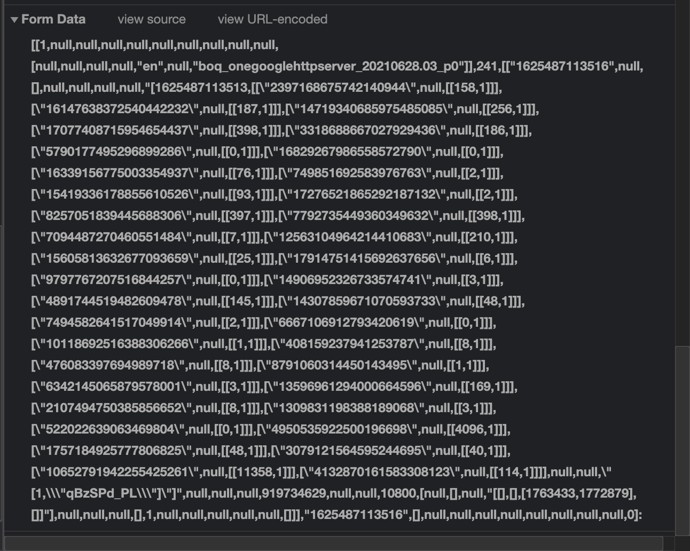

## Aprendizaje Supervisado 

* Sea $x^i \in \mathbb{R}^N$ y $y^i \in \mathbb{R}$
* $\mathcal{D} = (x^i, y^i)_{i=0, \dots, M-1}$ define nuestro dataset
* $f\colon \mathbb{R}^N \times \mathbb{R}^P \to \mathbb{R}$ predice $y$ de $x$ con parámetros $p$
* $\hat{y^i} = f(x^i, p)$
* Función de perdida: $\mathcal{L}(y^i, \hat{y^i})$
* $$
\min_{p} \mathcal{L}(f(x^i, p), y^i)
$$

### Ejemplo 

```table
x_0, x_1, y
0, 1,  2
2, 2,  4
4, 3,  6
```
* $N = 2, M=3$
* $f(x) = ax_0 + bx_1 + c$, $p = (a, b, c)$, $P = 3$
* $\mathcal{L} = \frac{1}{2}\sum_{i=0}^{2} (\hat{y^i} - y^i)^2$

## Entradas a un algoritmo ML

* En la mayoría de los casos tienen que ser números reales
* Dependiendo del algoritmo, debemos cuidar diferentes hipótesis

### Normalización

* Si el algoritmo se basa en una noción de distancia: LR, SVM, NN
* Necesitamos normalizar todas las entradas.
* No hacerlo, es una forma de darle más importancia a una característica.
* Tipos de normalización: escala estándar, escala máxima mínima, etc.
* Los árboles de regresión no se preocupan por la distancia: solo el orden.

### Orden ordinal

* Algunas funciones tienen un orden implícito: "malo, promedio, bueno"
* Deberán transformarse en números.
* Mantener su orden es importante:
    * malo = 2, promedio = 0, bueno = 1
    * malo = 0, promedio = 1, bueno = 2

### Categorías sin orden

* Considere los tipos de tela: camisa, pantalón, suéter.
* Encoder usando números asume un orden implícito:
* camisa = 0, pantalón = 1, suéter = 2
* Opción 1: One-Hot Encoding se transforma en tres nuevas funciones.
    * $x_{camisa} = 1, x_{pantalón} = 1, x_{suéter} = 1$
* Opción 2: codificación de destino (Target Encoding)
    * camisa = 42.1, pantalón = -3, suéter = 26

### Datos periódicos

* Similar a los datos ordinales
* Lunes = 0, martes = 1, ..., domingo = 6
* Diferencia Lunes - Martes! = Lunes - Domingo

## Entrenamiento y puntuación

### Enfoque básico

* Dividir el conjunto de datos en dos: uno para entrenamiento y otro para pruebas
* Generalmente 80% / 20%
* Propenso a sobre ajustar

### Un poco más avanzado

* Dividir el conjunto de datos en tres: entrenamiento, validación, prueba.
* Generalmente 80% / 10% 10%
* Utiliar el conjunto de entrenamiento para entrenar y el de validación para evaluar el rendimiento.
* Seleccionar hiper-parámetros según el conjunto de datos de validación.
* Entrenar con los mejores hiper-parámetros en entrenamiento + validación y calcular la métrica final con el conjunto de prueba.

### Mejores prácticas

* Dividir en tren y prueba.
* Generalmente 80% / 20%
* Dividir el conjunto de datos de entrenamiento en $ X = 3, 5, 10 $ y realizar una validación cruzada.
* Entrenar en groups de $X-1$ particiones y validar en la restante.
* Puntaje promedio en todas las particiones.
* Elija los parámetros con la puntuación media más alta.
* Ajustar el conjunto de datos del entrenamiento con los mejores hiper-parámetros y evaluar en el conjunto de prueba.

### Observaciones

* Idealmente, cada codificador / transformación / etc debería ser re-entrenado en cada split.
* Se vuelven a entrenar una vez al final para evaluar el conjunto de prueba.

## Gestión de Código 


### Cualidades deseadas

Al escribir código, como con cualquier otro documento colaborativo, nos gustaría:

* Tener una copia en la nube, para que no se pierda el progreso (copia de seguridad).
* Tener una herramienta que solucione problemas cuando las personas modifiquen el mismo archivo (conflictos).
* Tener una forma de volver a una versión anterior (historial).

### Git

* Pequeño programa desarrollado por Linus Torvalds (creador de Linux) en 2005.
* Es independiente del editor (TextPad, VSCode, Word, etc.).
* Guarda todos los cambios solicitados en un servidor remoto.
* El worflow tradicional consiste en:
    * Add (localmente)
    * Commit (creando un punto de control)
    * Push (subido al servidor)
    * Pull (descargado del servidor)

### Github

{ width="700px" }

### Github

* Github es un servicio que aloja servidores git.
* Proporciona una interfaz agradable para mirar el código.
* Es utilizado por casi todos los desarrolladores de código.
* Existen alternativas: gitlab, bitbucket, etc.

<!-- ## API -->

<!-- * Una vez que se entrena un modelo de aprendizaje automático, es necesario implementarlo para poder utilizarlo. -->
<!-- * Para implementar modelos de AA, a menudo usamos una interfaz de programación de aplicaciones (API). -->
<!-- * Una API es un programa que expone una URL personalizada: puede aceptar parámetros y devolver una respuesta. -->


<!-- ### Example API -->

<!-- * URL: "https://example.com/sum/" -->
<!-- * Cuando se llama con parámetros específicos devuelve la suma de "a" y "b" -->
<!-- * Podemos enviar parámetros en la URL "sum/?a=10&b=5" -->
<!-- * Obtenemos la respuesta: 15. -->

<!-- ### Tipos de API -->
<!-- * Las API utilizan HTTP / HTTPS. -->
<!-- * Normalmente, enviamos los tipos de mensajes "GET" o "POST". -->
<!-- * Cada mensaje contiene un ENCABEZADO: -->
<!--     * URL está aquí -->
<!--     * Información sobre el remitente (tipo de navegador, etc.) -->
<!--     * Información de autenticación si es necesario. -->
<!-- * Los mensajes pueden contener un CUERPO: -->
<!--     * Para mensajes grandes, el contenido puede estar aquí. -->

<!-- ### Ejemplo HTTP GET -->

<!-- { width="700px" } -->

<!-- ### Ejemplo HTTP POST -->

<!-- { width="700px" } -->

<!-- ### --> 

<!-- { width="700px" } -->

## Entorno de ejecución

* Una máquina virtual es una "copia de una computadora" que se ejecuta dentro de una computadora ".
* Ejemplo: ejecutar una computadora Linux dentro de una ventana en una computadora Windows.
* Es muy útil garantizar que un programa se ejecute dentro de la misma computadora en todas partes.
* Bastante pesado para compartir y no muy cómodo de usar.

### Docker

::: columns
:::: column

* Misma idea de máquina virtual, pero solo funcionalidad básica.
* Descrito usando un solo archivo, que se puede compartir a través de Github.

::::
:::: column

```Dockerfille
FROM ubuntu:lastest

RUN pip install -y matplotlib pandas seaborn jupyter

CMD ["jupyter-notebook"]
```

::::
:::

