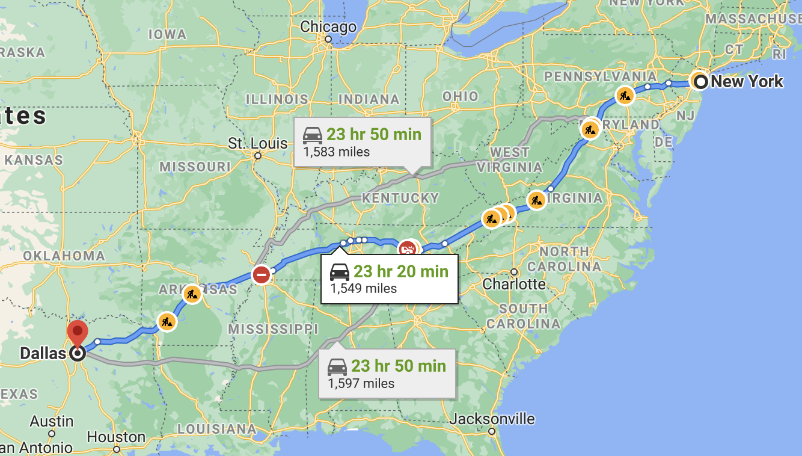
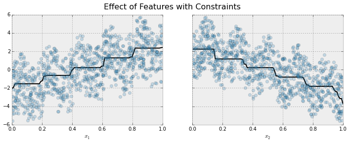
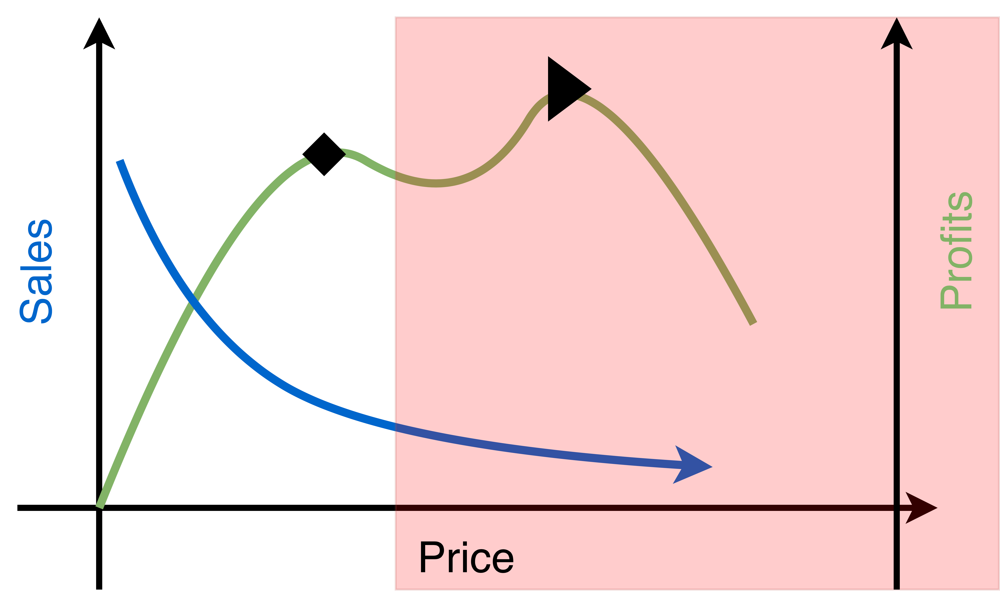

## Introducción

* El problema de optimización de precios es central en la literatura económica. 
* En general se asume una función de costos $C$ y una función de demanda $D$.
* Sabiendo ambas funciones se busca maximizar el revenue obtenido.


### Ejemplo

* Curva de demanda $D(p) = 200 - 50p$
* $\max_p D(p)*p - C(q)$
* $\max_p (200 - 50p)p - 2(200 - 50p)^2$
* $\max_p 200p - 50p^2 - 20000 + 10000p - 2500p^2$
* $\max_p -5050 p^2 + 20200 p - 20000$
* Máximo = 200 y precio óptimo = 2

### Optimización de precios en la práctica 

* La curva de demanda no es conocida, se debe aprender de los datos.
* La competencia no es estática y se actualiza.
* Existen muchas restricciones de negocio que deben ser incorporadas en el modelo de optimización.
* No siempre se maximiza revenue, a veces es más importante atraer nuevos clientes a bajo precio.

## Competencias de Precios en la práctica

### The Making of a Fly 

::: columns
:::: column

* Texto clásico en Biología, ya no se imprime más.
* En 2011 Amazon tenía 17 copias a la venta: 15 usadas y 2 nuevas.
* Las 15 usadas a $35.54
* Las nuevas a: $1,730,045.91 (+$3.99 de envío)
* [Reference](https://www.michaeleisen.org/blog/?p=358)

::::
:::: column

{ width="500px" }

::::
:::

### The Making of a Fly cont.

* Para el final del día estaban a $3,536,675.57 
* Una computadora estaba poniendo precios.
* El vendedor 1 ponía el precio a 0.9983 del vendedor 2.
* El vendedor 2 ponía el precio a 1.270589 del vendedor 1. (Por qué?)
* El precio llego hasta $23,698,655.93, antes de que fuese arreglado.

### Billetes de avión [Ref](https://www.airfarewatchdog.com/blog/50070032/when-skipping-a-flight-can-save-money-and-when-it-wont/)

::: columns
:::: column

{ width="500px" }

::::
:::: column

{ width="500px" }

::::
:::


## Dos acercamientos posibles

::: columns
:::: column
**Model Based**

* Aprendemos un modelo de elasticidad de los datos
* Usamos el modelo de elasticidad como input a un problema de optimización
* Restricciones del negocio como constraints en el PO.
* Approach a usar en este curso

::::
:::: column
**Model Free**

* No intentamos aprender elasticidad
* Modelo de Reinforcement Learning o similar.
* Cambiamos precios muy seguido y vemos como la demanda cambia.
* Requiere la capacidad de iterar con alta frecuencia. No siempre fácil.

::::
:::


### Más ejemplos de pricing en la práctica.

* Amazon: Amazon actualizó en promedio el precios de sus productos 2.5 millones de veces al día (2013). 
* Aerolíneas: Muy dependiente del precio de la competencia: todos hemos buscado un pasaje y ver como sube la segunda vez que entramos.

## Aprender elasticidad

* Entrenar un modelo que prediga demanda y use el precio como atributo.
* Con el modelo entrenado, crear nuevas filas cambiando el precio.
* El resultado es una curva de demanda para cada uno de los distintos precios.
* Requiere que en los datos haya suficientes variaciones de precio.

### Ejemplo

```table
Color, Precio, Marca, Unidades Vendidas
Rojo, 10, Zara, 3
Rojo, 12, Zara, 1
Azul, 5, Zara, 4
Verde, 6, Victoria's Secret, 6
Azul, 7, Victoria's Secret, 4
```

### Generar curva de demanda

```table
Color, Precio, Marca
Verde, 1, Victoria's Secret
Verde, 3, Victoria's Secret
Verde, 5, Victoria's Secret
Verde, 7, Victoria's Secret
Verde, 9, Victoria's Secret
Verde, 11, Victoria's Secret
```
* La predicción del modelo en el dataset de arriba es nuestra curva.

### Salida del modelo 

```table
Color, Precio, Marca, Unidades Venidas
Verde, 1, Victoria's Secret, 10
Verde, 3, Victoria's Secret, 8
Verde, 5, Victoria's Secret, 3
Verde, 7, Victoria's Secret, 5
Verde, 9, Victoria's Secret, 1
Verde, 11, Victoria's Secret, 2
```
* Es posible que aumente la demanda aumentando el precio. Por qué? 

### Introduciendo sesgo en el modelo

::: columns
:::: column
{ width="100%" }
::::
:::: column
{ width="100%" }
::::
:::

### Implementación usando XGBoost

```python
import xgboost as xgb
params_constrained = dict()
params_constrained['monotone_constraints'] = "(1,-1)"

model_with_constraints = xgb.train(params_constrained, dtrain,
                                   num_boost_round = 1000, evals = evallist,
                                   early_stopping_rounds = 10)
```

## Trabajando con stock infinito


::: columns
:::: column
{ width="500px" }
::::
:::: column

* Netflix puede vender su servicio cuantas veces como quiera.
* Le gustaría poder hacer price optimization por segmentos.
* Aprender que tipos de clientes responden a cambios en el precio y cuantos no.

::::
:::

### 

Si se tiene mucha descripción del consumidor, no es fácil contar ventas.

```table
ID, País, Estado, Ciudad,  Edad, Fecha, Precio
0, Uruguay, Maldonado, Maldonado, 54, 2020-09-06, 4 USD
1, Uruguay, Maldonado, Maldonado, 22, 2020-09-06, 4 USD
2, Holanda, North Holland, Amsterdam, 31, 2020-09-07, 8 EUR
3, Alemania, NRW, Colonia, 33, 2020-09-21, 7 EUR
```
* Si hay una fila, implica una venta o renovación.
* Si miramos la serie temporal de Amsterdam 31 años, es casi toda ceros.

### Información complementaria

```table
ID, hay Disney+, precio D+, hay HBO Go, precio HG, fam. tiene Netflix?
0, true, 5 USD, false, null, true
1, true, 5 USD, false, null, false
2, true, 6 USD, true, 6 USD,  false
3, true, 10 USD, true, 8 USD, true
```


### Agregando segmentos

> Cómo lo harías tu?


###

```table
---
table-width: 1/3
---
Continente, Mes, Año, Edad, Precio, Ventas
Sudamérica, 09, 2021, [50; 59), 4 USD, 1
Sudamérica, 09, 2021, [18; 29), 4 USD, 1
Europa, 09, 2021, [30; 39), 7.5 EUR, 2
```
* Muchas veces tenemos que agrupar en segmentos 
* Como preservar la mayor cantidad posible de información individual?
* Puede incluir mucha perdida de información

### Incluyendo información sobre filas individuales

```table
---
table-width: 1/3
---
Continente, Mes, Año, Edad, Std Precio, % Mejor D+
Sudamérica, 09, 2021, [50; 59), 0, 100
Sudamérica, 09, 2021, [18; 29), 0, 100
Europa, 09, 2021, [30; 39), 0.5, 50
```

## Stock finito

* En lugar de crear segmentos, se pueden repetir todos los elementos en cada periodo.
* La variable objetivo es 1 si se vendió y 0 si no.
* Si un producto se vende, lo sacamos a partir del próximo período.
* Problema de clasificación, se predice probabilidad de venta.

## Optimización

{ width="700px" }

### Estructura básica

* La variable es el precio, pero pueden ser muchos precios.
* Las restricciones del negocio entran aquí. Ejemplo: no más de un 5% de cambio.
* Puede haber restricciones entre segmentos: número total de ventas, etc.
* Cuantas más restricciones, más difícil se vuelve el problema. Balance entre "soft" y "hard".
