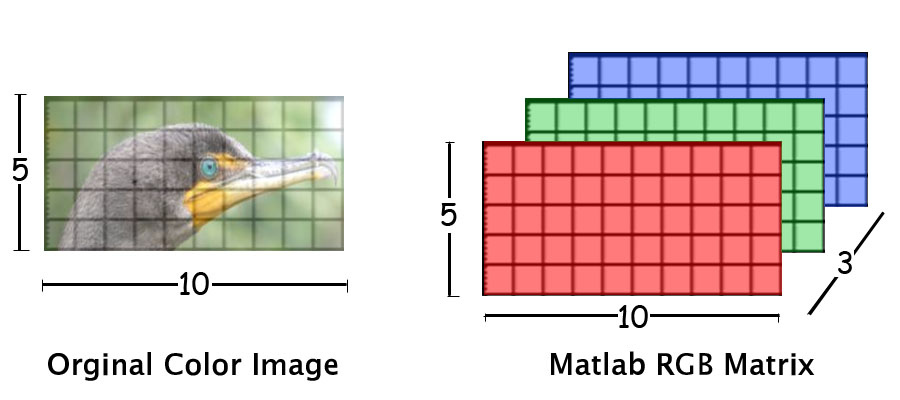
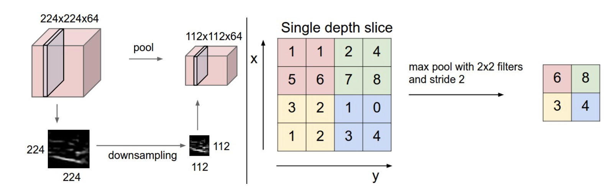
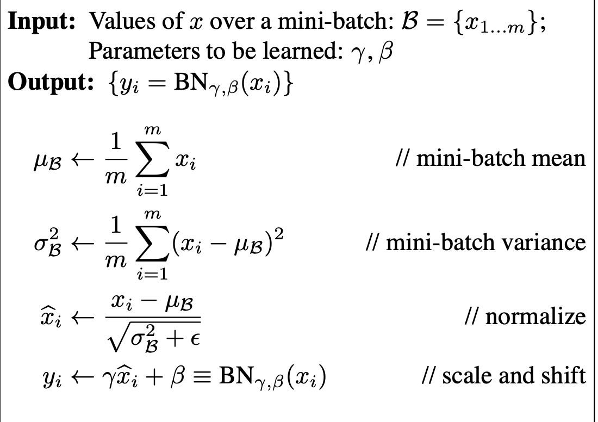
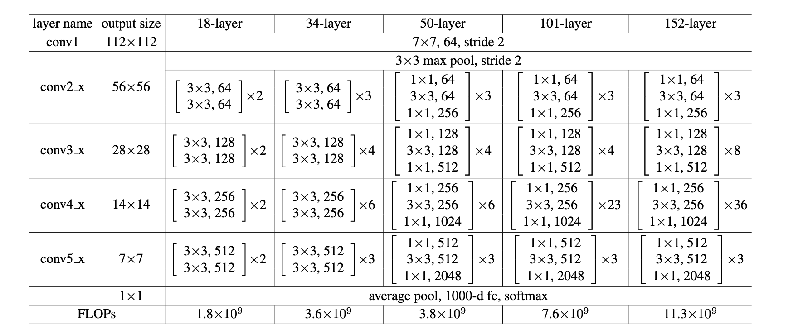

## Objetivos

* Ejemplos motivadores
* Repaso de redes neuronales
* Imagenes como matrices
* Componentes tradicionales de una CNN
* GPU


## Ejemplos

### De quién es esa cara?

[Esta persona no existe, enlace](https://thispersondoesnotexist.com)

### Gatos y líneas

[Dibujame como una de tus chicas francesas..](https://affinelayer.com/pixsrv/)


## Repaso de Redes Neuronales

### Capas completamente conectadas

{ width="800px" }

### Perceptron

{ width="800px" }:

### Backpropagation

{ width="1000px" }

### Típicas funciones de activación: Relu

$$
f(x) = \max\{x, 0\}
$$

```{.python .cb.run jupyter_kernel=python3}
%matplotlib inline
import datetime
import matplotlib.pyplot as plt 
import pandas as pd
import numpy as np
```

```{.python .cb.run}
fig, ax = plt.subplots()
x = np.arange(-5, 5, 0.1)
y = np.maximum(x, 0)
ax.plot(x, y)
ax.grid()
```

### Típicas funciones de activación: Tanh

$$
f(x)={\cfrac {e^{x}-e^{-x}}{e^{x}+e^{-x}}}
$$


```{.python .cb.run}
fig, ax = plt.subplots()
x = np.arange(-10, 10, 0.1)
y = np.tanh(x)
ax.plot(x, y)
ax.grid()
```


### Típicas funciones de activación: Sigmoide

$$
f(x) = \frac{1}{1+e^{-x}}
$$


```{.python .cb.run}
fig, ax = plt.subplots()
x = np.arange(-10, 10, 0.1)
y = 1 / (1 + np.exp(-x))
ax.plot(x, y)
ax.grid()
```

### Epoch vs Batch vs Iteration

::: columns
:::: {.column width=30%}
**Epoch**

* Todo el dataset hace una pasada (A y A)
* El dataset pasa una sola vez
* Se pueden necesitar muchos Epochs
::::
:::: {.column width=30%}
**Batch**

* Todo el dataset no entre de una.
* Se divide en distintos batches.
* Pueden cambiar de epoch a epoch
::::
:::: {.column width=30%}
**Iteration**

* Es la cantidad de batches necesarios para completar un epoch.
::::
:::


## Imágenes como matrices

* Necesitamos representar imágenes en computadora
* La representación tiene que ser entendible por una computadora: números.
* Idea: partir imágenes en pixels y asignarle a cada pixel un color.
* Idea: cada color se representa de forma numérica.

### Red - Green - Blue (RGB)

* Todos los colores se pueden representar como una mezcla de rojo, verde y azul.
* Normalizamos la cantidad de de cada color del 0 al 100% (o del 0 al 1).
* Representar decimales en una computadora es difícil, enteros es más fácil.
* Con 8 bits tenemos 256 niveles. Idea: RGB cada uno ocupa 8 bits y varían en $[0, 255)$

### Pixels como entrada de matrices

* Para una imagen en blanco y negro, usamos una sola matriz.
* Cada pixel representa la intensidad entre blanco y negro.
* Para imágenes a color, usamos 3 matrices del mismo tamaño, una para cada canal: RGB.

### Ejemplo

{ width="1000px" }

## Redes convolucionales

* En general las redes convolucionales son arquitecturas profundas con algunas capas especiales.
* En particular, el nombre viene del uso de capas convolucionales (más en breves)
* Menos libertad que una red "fully-connected", pero mejores en la práctica.

### Capa convolucional

* Creamos un bloque de pesos mucho más chico que la imagen original.
* Calculamos la multiplicación de ese bloque y una parte de la imagen.
* Vamos moviendo el bloque a través de la matriz. Se usan muchos menos pesos.


### Capa convolucional

{ width="800px" }

### Capa convolucional

::: columns
:::: column

{ width="500px" }
::::
:::: column
* Diferencia entre el pixel original y su pixel a la izquierda.
* Imágenes tienen tamaño 280 x 320 pixels.
* Usando convoluciones require: $319 × 280 × 3 = 267960$ operaciones
* Usando “fully-connected”: 320 × 280 × 319 × 280
* 4 billones de veces más eficiente.

::::
:::

### Capa "pooling"

{ width="1000px" }

### Capa "pooling"

* Remplaza una vecindad con una estadística de la vecindad
* Permite reducir la dimensionalidad de la imagen.
* Equivalente a tener una “prior bayesiana”
* Pooling hace la activación “invariante” a pequeñas traslaciones

### Capa "pooling"

{ width="800px" }

### Batch Normalization

::: columns
:::: column
* Los mini-batches cambian de distribución
* Esto complica el aprendizaje (descenso por gradientes)
* Idea, normalizar después de cada convolución, antes de activación
::::
:::: column
{ width="500px" }
::::
:::

### Global Pooling + FC + Softmax   

* Última capa para clasificación de imágenes
* Global pooling toma todo el promedio por canal
* Luego, FC del tamaño de la cantidad de clases
* Salida es un vector igual a la cantidad de clases.
* Función softmax para calcular probabilidad por clase.

### Resnets

{ width="500px" }

### Resnets

{ width="1000px" }

## Graphics Processing Units (GPU)

* Son circuitos diseñados para procesar imagenes de forma rápida
* Se originaron en la industria de los videojuegos en los 70'
* Permiten realizar muchas operaciones similares (aritmética) en paralelo.
* NVIDIA es el fabricante más conocido.

## GPUs y aprendizaje profundo

* La operación de convolución es fácilmente paralelizable
* Esto es xq usa los mismos parametros para toda la imágen.


## Referencias

* [DeepLearningBook](https://www.deeplearningbook.org/)
* [Curso Stanford](https://cs231n.github.io/convolutional-networks/)
* [Batch Normalization](https://arxiv.org/pdf/1502.03167.pdf)
* [Resnets](https://arxiv.org/pdf/1512.03385.pdf)
